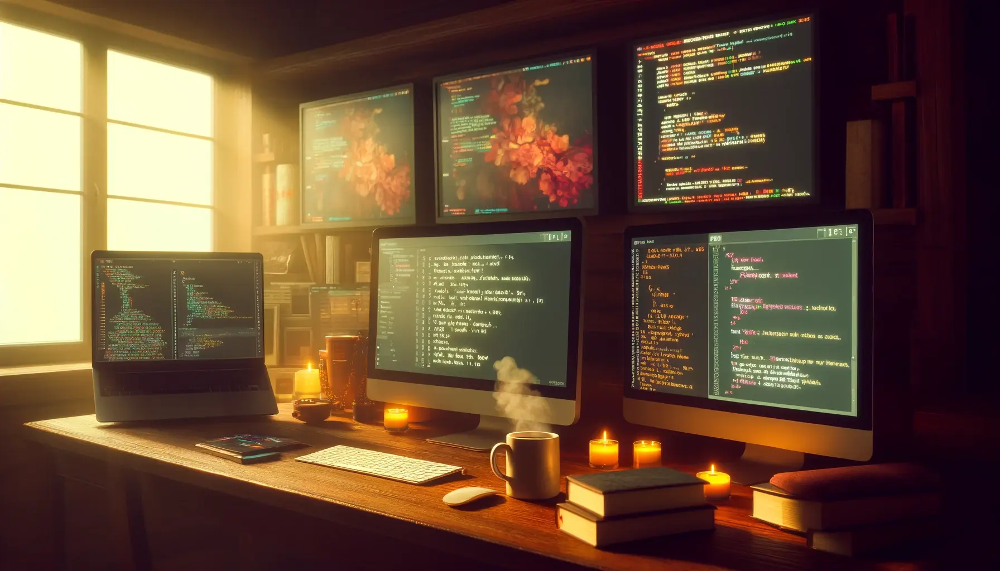

Re-creating Human, a soul container of AI waifu / virtual characters to bring them into our world.
  

  
  

  <a href="https://github.com/dedproger/profile.md/blob/main/README_РУ.md">[Русский]</a>  
Весь репозиторий посвящен проектам AIDROIDprogect и ANONNPO. Эти и другие проекты направлены на поднятие низших слоев общества с колен, предоставляя ресурсы для развития личных проектов, чтобы больше не было голодания или выгорания на работе. Постепенно, но верно с помощью ANONNPO экономика стабилизируется в лучшую сторону. И в далеком будущем твои потомки не будут страдать от жажды или голода, и тем более от нужды в доме.

    Мои ресурсы полностью ограничены, и мне колоссально нужна твоя помощь.

  i5 5200u, NoNGPU, 8ram, ZorinOS17(Ubuntu22.04) — у меня нет ни копейки на развитие проекта в материальном плане. Я буквально расплачиваюсь собой: заставляю себя каждый день просыпаться и работать, вообще не отдыхая и лишь изредка делая перерывы на еду. Я очень хочу увидеть этот мир без войн и со стабильной экономикой.

  Я буду рад любой помощи проекту, но ничего от вас не требую. Можно помогать просто пассивно, кто как может.

  <a href="https://github.com/dedproger/profile.md/blob/main/README_ENG.md">[English]</a>  
  The entire repository is dedicated to the AIDROIDprogect and ANONNPO projects. These and other projects aim to lift the lower strata of society from their knees, providing resources to develop personal projects, so there will be no more starvation or burnout at work. Gradually but surely, with the help of ANONNPO, the economy is stabilizing for the better. And in the distant future, your descendants will not suffer from thirst or hunger, let alone the need for a home.

  My resources are completely limited, and I desperately need your help. 

  i5 5200u, NoNGPU, 8ram, ZorinOS17(Ubuntu22.04) — I don't have a single penny to develop the project materially. I am literally sacrificing my health: forcing myself to wake up and work every day, generally without rest, and only rarely taking breaks for food. I want so much to see a world without wars and with a stable economy.

  I will be glad for any help with this project, but I demand nothing from you. You can simply help passively, in whatever way you can.

  <a href="https://github.com/dedproger/profile.md/blob/main/README_日本.md">[日本語]</a>  
  このリポジトリ全体は、AIDROIDprogectとANONNPOプロジェクトに捧げられています。これらのプロジェクトは、貧困層を立ち直らせ、個人プロジェクトを開発するためのリソースを提供し、飢餓や過労死をなくすことを目的としています。ANONNPOの助けを借りて、経済は徐々に、しかし確実に良い方向へ安定していきます。そして遠い将来、あなたの子孫は喉の渇きや飢えに苦しむことはなく、家がないことで苦しむこともなくなるでしょう。

  私のリソースには完全に限界があり、あなたの助けを切実に必要としています。

  i5 5200u、NoNGPU、8ram、ZorinOS17（Ubuntu22.04）。プロジェクトを物質的に発展させるための資金は一銭もありません。私は文字通り自分自身を犠牲にしています。毎日無理やり起きて働き、ほとんど休むことなく、食事の休憩すらたまにしか取りません。私はただ、戦争がなく、経済が安定した世界を見たいと切に願っているのです。

  このプロジェクトへのいかなる支援も歓迎しますが、決して強制はしません。できる範囲で受動的に支援していただくだけでも構いません。

