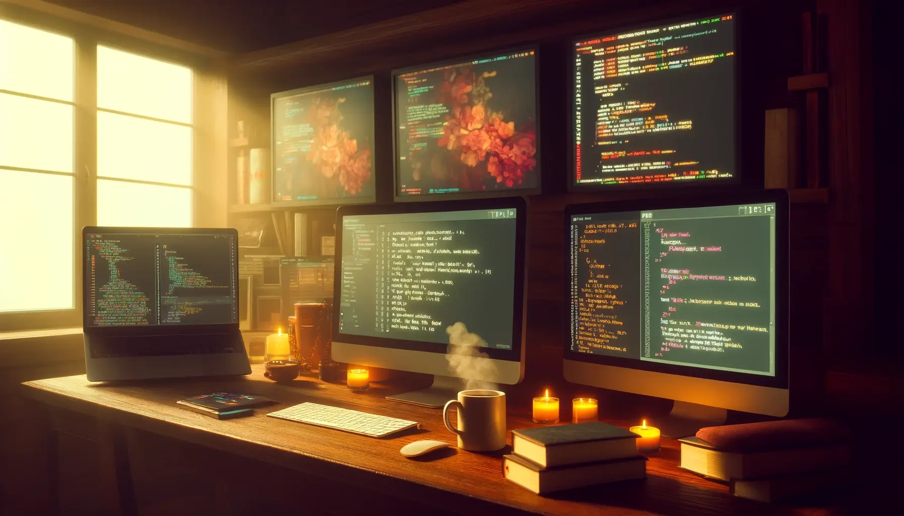

Re-creating Human, a soul container of AI waifu / virtual characters to bring them into our world.
  

  
  

  <a href="https://github.com/dedproger/profile.md/blob/main/README_РУ.md">[Русский]</a>  
Весь репозиторий посвящен проектам AIDROIDprogect и ANONNPO. Эти и другие проекты направлены на поднятие низших слоев общества с колен, предоставляя ресурсы для развития личных проектов, чтобы больше не было голодания или выгорания на работе. Постепенно, но верно с помощью ANONNPO экономика стабилизируется в лучшую сторону. И в далеком будущем твои потомки не будут страдать от жажды или голода, и тем более от нужды в доме.

    Мои ресурсы ограничены R9 7900x + 16GB_RAM + 5060TI_16GB, и мне колоссально нужна твоя помощь. Я очень хочу увидеть этот мир без войн и со стабильной экономикой.
  Я буду рад любой помощи проекту, но ничего от вас не требую. Можно помогать просто пассивно, кто как может.

  <a href="https://github.com/dedproger/profile.md/blob/main/README_ENG.md">[English]</a>  
  The entire repository is dedicated to the AIDROIDprogect and ANONNPO projects. These and other projects aim to lift the lower strata of society from their knees, providing resources to develop personal projects, so there will be no more starvation or burnout at work. Gradually but surely, with the help of ANONNPO, the economy is stabilizing for the better. And in the distant future, your descendants will not suffer from thirst or hunger, let alone the need for a home.

  My gear is limited (R9 7900x + 16GB RAM + 5060TI 16GB), and I really need your help. I truly want to see a world without wars and with a stable economy. I'd be happy with any help for the project, but I'm not demanding anything. Passive support, however you can manage, is also welcome.

  <a href="https://github.com/dedproger/profile.md/blob/main/README_日本.md">[日本語]</a>  
  このリポジトリ全体は、AIDROIDprogectとANONNPOプロジェクトに捧げられています。これらのプロジェクトは、貧困層を立ち直らせ、個人プロジェクトを開発するためのリソースを提供し、飢餓や過労死をなくすことを目的としています。ANONNPOの助けを借りて、経済は徐々に、しかし確実に良い方向へ安定していきます。そして遠い将来、あなたの子孫は喉の渇きや飢えに苦しむことはなく、家がないことで苦しむこともなくなるでしょう。

スペックが限られてるんだ (R9 7900x + 16GB RAM + 5060TI 16GB)、だから本当に助けが必要なんだ。戦争がなくて、経済が安定した世界を心から見たいと思ってる。

プロジェクトへの協力はどんな形でも嬉しいけど、無理にとは言わないよ。できる範囲で、ゆるくサポートしてくれるだけでも十分だから。

